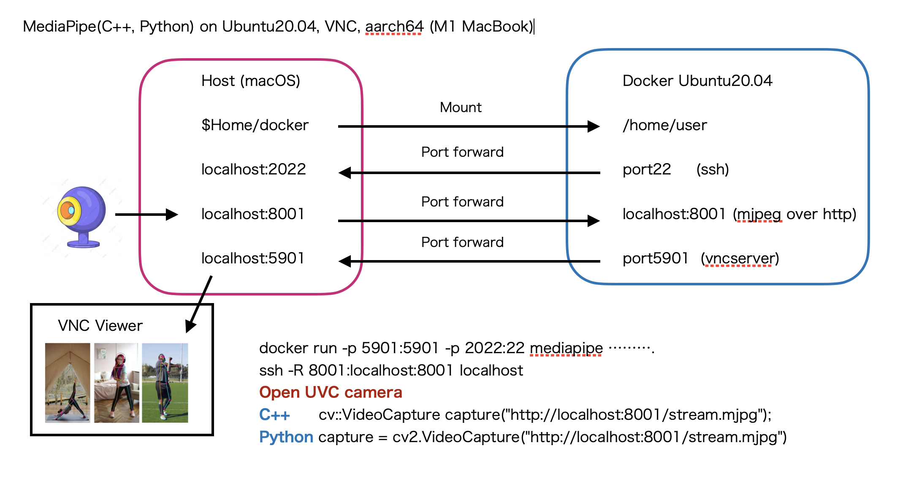

# MediaPipe(C++, Python) on Ubuntu20.04, VNC, aarch64 (M1 MacBook, Docker)

# Introduction

Working [MediaPipe](https://google.github.io/mediapipe/) on C++, Python.



# Environment

- M1 MacBook Air (2020)
- M1 PRO MacBook PRO, Yet testing (Ordered)

# Build

```
docker build -t mediapipe . --build-arg USER=username --build-arg PASSWD=password
```

# Run

```
docker run -d -p 5901:5901 -p 2022:22 -v usr-local:/usr/local -v $HOME/docker:/home/username --name mediapipe mediapipe
```

# Host Machine: run mjpeg over http

UVC camera connect Host machine, with mjpeg over http server.

```
git clone https://github.com/meska/mjpeg_stream_webcam.git
cd mjpeg_stream_webcam
python mjpegsw.py --port 8001
```

SSH login to docker machine, with port foward.

```
ssh -R 8001:localhost:8001 localhost
```

# start vnc server

```
exec from .bash_profile

bin/start-vncserver.sh
```

# VNC Viewer

on macOS Finder

```
passwd: vncpasswd
```


# MediaPipe (on Docker Ubuntu)

## Install Bazel

```
wget https://github.com/bazelbuild/bazel/releases/download/4.2.1/bazel-4.2.1-linux-arm64
sudo chmod +x bazel-4.2.1-linux-arm64
sudo cp bazel-4.2.1-linux-arm64 /usr/local/bin/bazel
```

## Build python lib

```
git clone https://github.com/google/mediapipe.git
cd mediapipe
git checkout v0.8.8

sudo chmod 777 /usr/local/lib/python3.8/dist-packages
```

edit mediapipe/third_party/opencv_linux.BUILD

```
diff --git a/third_party/opencv_linux.BUILD b/third_party/opencv_linux.BUILD
index 8445855..afc3700 100644
--- a/third_party/opencv_linux.BUILD
+++ b/third_party/opencv_linux.BUILD
@@ -18,14 +18,14 @@ cc_library(
         #"include/aarch64-linux-gnu/opencv4/opencv2/cvconfig.h",
         #"include/arm-linux-gnueabihf/opencv4/opencv2/cvconfig.h",
         #"include/x86_64-linux-gnu/opencv4/opencv2/cvconfig.h",
-        #"include/opencv4/opencv2/**/*.h*",
+        "include/opencv4/opencv2/**/*.h*",
     ]),
     includes = [
         # For OpenCV 4.x
         #"include/aarch64-linux-gnu/opencv4/",
         #"include/arm-linux-gnueabihf/opencv4/",
         #"include/x86_64-linux-gnu/opencv4/",
-        #"include/opencv4/",
+        "include/opencv4/",
     ],
     linkopts = [
         "-l:libopencv_core.so",
```

Failed bdist_wheel, but SUCCESS!! install --link-opnecv

```
python setup.py gen_protos
python setup.py install --link-opencv
```

```
sudo pip install -r mediapipe/requirements.txt
```

# Reference

- https://google.github.io/mediapipe/getting_started/python.html
- [Qiita in Japanese](https://qiita.com/kose3/items/38b9b7ba7a2747c60eba).
